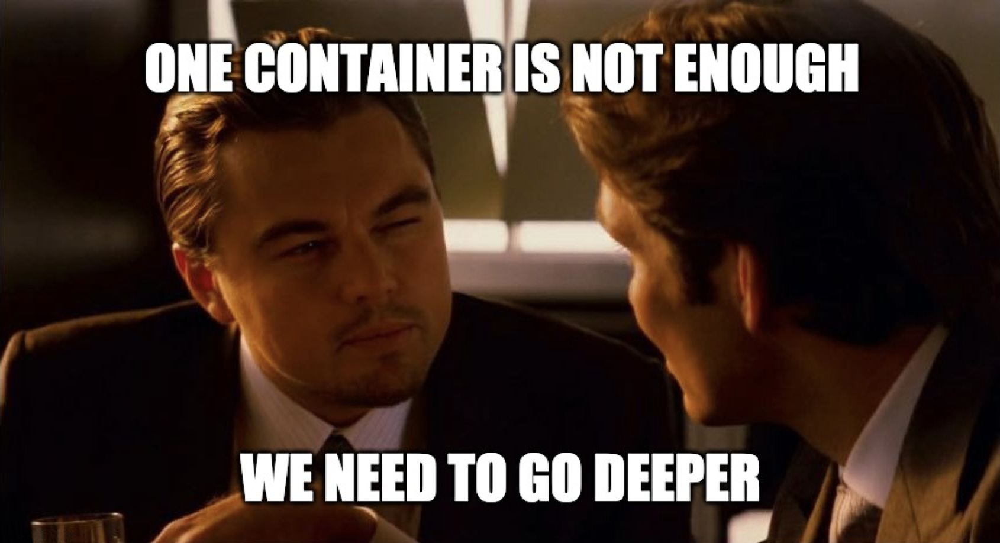
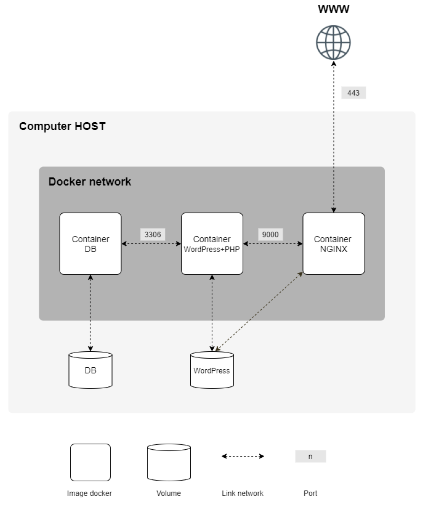
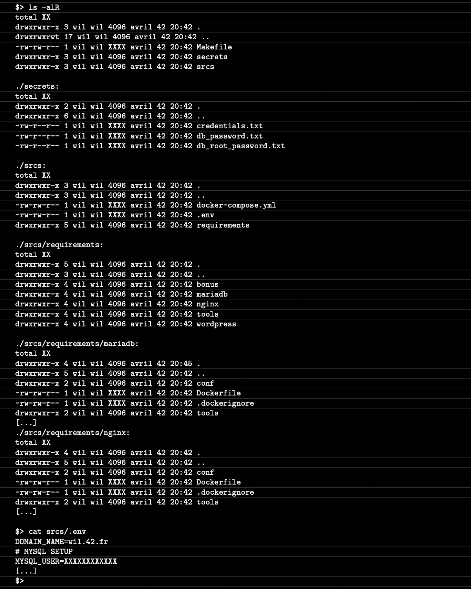
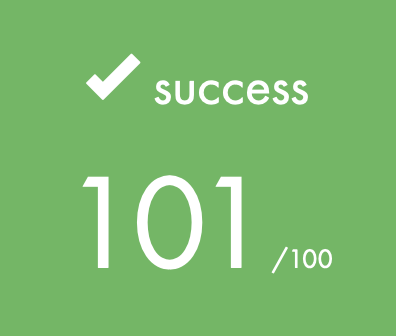

  

# 🚀 INTRODUCTION

The `inception` 42 project challenges students to harness the power of containerization to build a fully functional, modular infrastructure.

By leveraging Docker's capabilities, this project focuses on orchestrating multiple containers to create a robust, isolated environment where different services work seamlessly together.

From configuring a secure web server to managing a persistent database, the `inception` project emphasizes precision, security, and efficiency. This journey is not just about mastering the tools, but about understanding the critical architectural decisions that drive modern software deployment.

# 🛠️  Program Specificities and Considerations

> [!WARNING]
> This project aims to be executed in a x86 Linux environment, in a VM, with advanced configuration.
>
> `so sorry but in this repo, i won't show you how to test with your machine.`

I will have to put in place :
- A Docker container containing NGINX with TLSv1.2 or TLSv1.3 only.
- A Docker container containing WordPress + php-fpm (installed and configured) only, without nginx.
- A Docker container containing MariaDB only without nginx.
- A volume containing your WordPress database.
- A second volume containing your WordPress site files.
- A docker network that will link your containers.

> [!NOTE]
> My containers will need to restart in case of a crash.
 

Here an example of what i have put in place :

  

 

and the architecture we need to do the project :

  

My final grade :

## 🤝 Contribution
Contributions are open, make a pull request or open an issue 🚀
